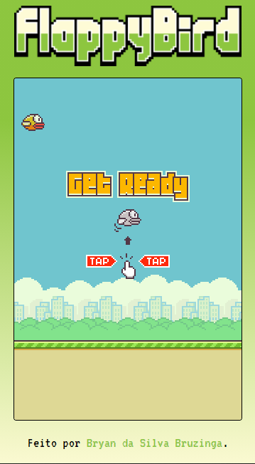
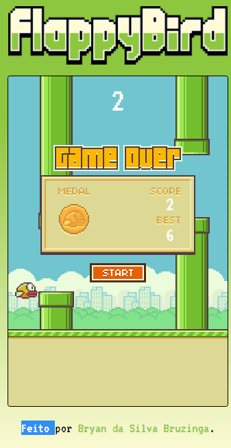

<h1 align="center">Flappy Bird Clone</h1>
<h2 align="center">Um clone do Flappy Bird feito com HTML e JS</h2>

<h2>O Projeto</h2>

O projeto é um clone do infame jogo Flappy Bird, o jogo do passarinho tentando sobreviver contra os tubos saídos diretamente do mundo do Mario, que com certeza tirou muita gente do sério (eu inclusive rsrs).

  

<i>Screenshot da tela.</i>

<h2>Jogabilidade</h2>

O jogo basicamente contém todas as funcionalidades do jogo original, com o jogador marcando pontos a medida que atravessa entre os canos, também possui um controle para evitar que o jogador saia da tela se tentar pular mais do que deveria, o jogador perde ao tocar em um dos tubos ou ao bater no chão.

A melhor pontuação é salva no localStorage, assim o usuário não perde seu Record.

Assim que o jogador bate em algo, o placar é exibido mostrando a pontuação feita, se caso ela for maior que a melhor pontuação salva anteriormente, então ela será salva como o novo Record. Também há um sistema de medalhas a baseada na quantidade de pontos que o jogador alcança, asssim como no original, sendo nesse caso:

<ul>
  <li>Pontuação até 3 = Medalha Bronze</li>
  <li>Pontuação até 8 = Medalha Prata</li>
  <li>Pontuação até 15 = Medalha Ouro</li>
  <li>Pontuação acima de 15 = Medalha Platina</li>
</ul>

  

<i>Screenshot da tela de placar.</i>

<a href="https://bryanbruzinga.github.io/FlappyBird/">Link para jogar.</a>
